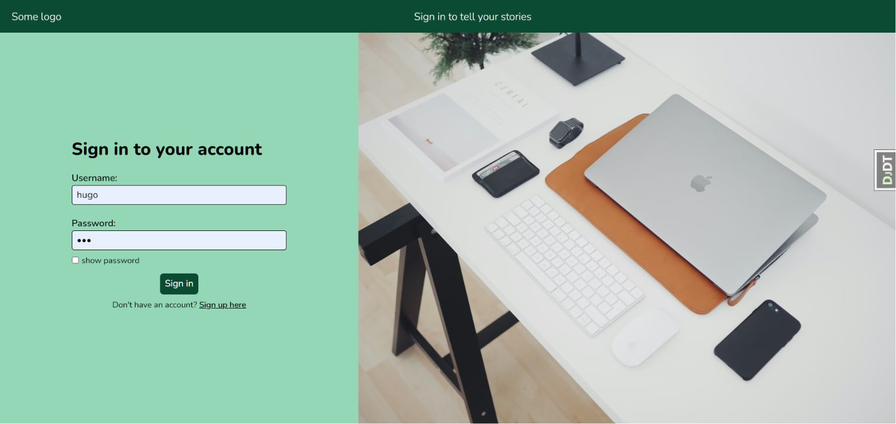
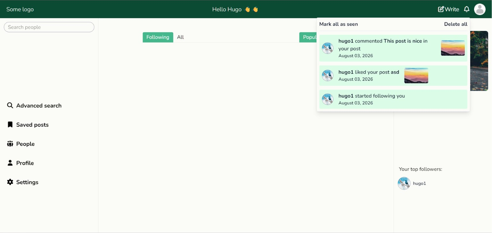
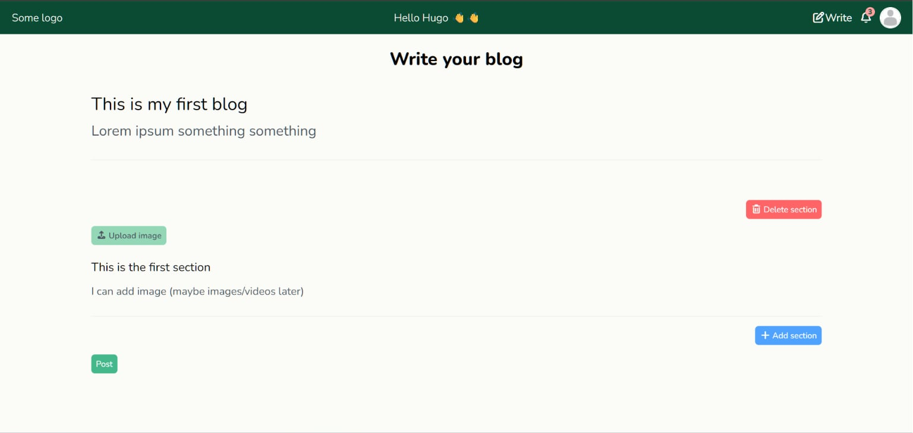
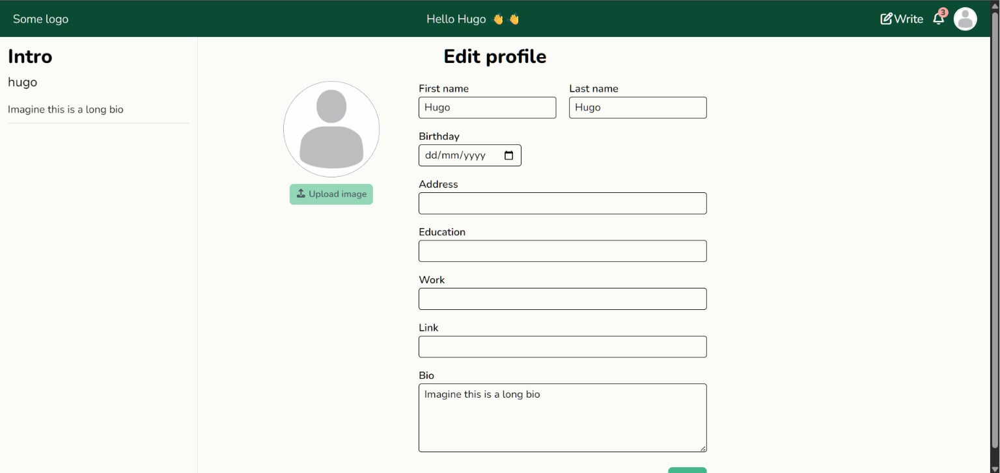

# Django Blog Web App

### Demo: https://mywebblog.site/ (might be taken down in the future)

### A social media platform for people to post and share their wonderful stories in the form of blogs, built with Django, HTMX, Alpine.js, Tailwind CSS, and deployed with Granian (inspired by [Medium](https://medium.com/))

## Snapshots:






## Features:

- [x] User authentication (register, login, logout)
- [x] Create, edit, and delete blog posts
- [x] Comment system with nested comments
- [x] Full-fledged search feature with filters for both users and blogs
- [x] Interactive UI components (dropdowns, modals, toggles)
- [x] Toast notifications for user actions
- [ ] Dark mode support
- [ ] Fully responsive layout

### Coming feature:

- Live chat

## Tech Stack:

| Layer      | Technology                                                                               |
| ---------- | ---------------------------------------------------------------------------------------- |
| Backend    | [Django](https://www.djangoproject.com/)                                                 |
| UI Logic   | [HTMX](https://htmx.org/) and [Alpine.js](https://alpinejs.dev/)                         |
| Styling    | [Tailwind CSS](https://tailwindcss.com/) and [Django Cotton](https://django-cotton.com/) |
| Deployment | [Granian](https://github.com/emmett-framework/granian) and [Nginx](https://nginx.org/)   |
| Database   | [SQLite](https://sqlite.org/) (dev) / [PostgreSQL](https://www.postgresql.org/) (prod)   |

## Getting Started:

### Prerequisites:

- Python 3.12+ and pip
- Node.js and npm
- **Recommended alternatives:**
   - [uv](https://docs.astral.sh/uv/) in place of pip
   - [bun](https://bun.com/) in place of npm

> **_NOTE:_** It's strongly recommended to use uv and bun in the scope of this project for better integration and speed.

### Installation:

#### 1. Clone the repository

```
git clone https://github.com/hugoquintel/django-blog-web-app.git
cd django-blog-web-app
```

#### 2. Create and activate a virtual environment

```
python -m venv venv            # This step is unnecessary if you are using uv; go to step 3 instead
source venv/bin/activate       # macOS/Linux
venv\Scripts\activate          # Windows
```

#### 3. Install Python dependencies

```
pip install .                  # You might want to remove the `build/` directory generated by pip
pip install -e .               # Run this command instead if you want to install the dependencies in editable (development) mode

# or (using uv)

uv sync --frozen
```

#### 4. Install Node dependencies

```
npm install
npm install --omit=dev         # Run this command instead if you don't want devDependencies

# or (using bun)

bun install
bun install --frozen-lockfile --production    # Run this command instead for production-ready build
```

> **_NOTE:_** If you are using pip or npm, and want the exact dependencies' version (e.g. for reproducible production-build), you have to manually pin the version of each dependency in `pyproject.toml` or `package.json`. Also, HTMX and AlpineJS have no build step. So, in case you want to update the packages, their CDNs must be installed directly into the project repository; the files are stored in [./src/core/static/js](./src/core/static/js)

#### 5. Set up environment variables

<pre><code># Add a .env file in the root of the project and modify it with these variables:

# Django settings

DEBUG=[True/False]
SECRET_KEY=[Your secret key]
ALLOWED_HOSTS=[list of allowed hosts, comma separated, e.g .mywebblog.site,127.0.0.1,localhost]
STATIC_ROOT=[path to the static folder; doesn't work with debug mode. For more information, check <a href="https://docs.djangoproject.com/en/6.0/howto/static-files/deployment/#serving-static-files-in-production">here</a>]
MEDIA_ROOT=[path to the media folder. For more information, check <a href="https://docs.djangoproject.com/en/6.0/ref/settings/#std-setting-MEDIA_ROOT">here</a>]

# Granian settings (The information for the variables below can be checked <a href="https://pypi.org/project/granian/">here</a>, at the Options part)

GRANIAN_ADDRESS=[Host address to bind to (doesn't matter with GRANIAN_UDS enabled)]
GRANIAN_PORT=[Port to bind to (doesn't matter with GRANIAN_UDS enabled)]
GRANIAN_WORKERS=[Number of worker processes]
GRANIAN_BACKPRESSURE=[Maximum number of requests to process concurrently (per worker)]
GRANIAN_BLOCKING_THREADS=[Number of blocking threads (per worker)]
GRANIAN_UDS=[Unix Domain Socket to bind to (if there is none, default back to TCP/IP socket)]

# Postgresql settings (For more information, check <a href="https://docs.djangoproject.com/en/6.0/ref/settings/#databases">here</a>)

USE_POSTGRES=[True/False (if False, default to SQLite)]
POSTGRES_DB=[The name of the database]
POSTGRES_USER=[The username to use when connecting to the database]
POSTGRES_PASSWORD=[The password to use when connecting to the database]
POSTGRES_HOST=[Which host to use when connecting to the database. An empty string means UNIX domain sockets]
POSTGRES_PORT=[The port to use when connecting to the database. An empty string means the default port (5432 for Postgresql)]

# HTTPS settings (Recommend turning these settings off and using a reverse proxy like Nginx to handle HTTPS. For more information, check <a href="https://docs.djangoproject.com/en/6.0/topics/security/#ssl-https">here</a>)

ENABLE_HTTPS=[True/False (if False, none of the settings below will take effect)]
SECURE_HSTS_SECONDS=[how long a browser should remember to only connect via HTTPS using the Strict-Transport-Security header]
SECURE_SSL_REDIRECT=[If True, the SecurityMiddleware redirects all non-HTTPS requests to HTTPS]
SECURE_HSTS_INCLUDE_SUBDOMAINS=[If True, the SecurityMiddleware adds the includeSubDomains directive to the Strict-Transport-Security header]
SECURE_HSTS_PRELOAD=[If True, the SecurityMiddleware adds the preload directive to the Strict-Transport-Security header]
</code></pre>

### Run the application:

#### 1. Tailwind CSS

```
npm run build                  # Run this line to generate a global css file for the entire application (should be used in production)
npm run start                  # Or run this line to watch for changes and rebuild CSS (should be used in development)

# or (using bun)

bun run build
bun run start
```

#### 2. Django application

```
python3 src/manage.py migrate             # Apply migrations
python3 src/manage.py createsuperuser     # Create a superuser
python3 src/manage.py runserver           # Run this line to initalize the development server
python3 src/manage.py rungranian          # Or run this line to start the application with the production-ready Granian server

# or (using uv)

uv run src/manage.py migrate
uv run src/manage.py createsuperuser
uv run src/manage.py runserver
uv run src/manage.py rungranian
```

## Deployment:

### _The steps below are an **oversimplified process** for how to deploy this project_

1. Set `DEBUG=False` and configure environment variables accordingly in `.env`
2. Run `npm run build` or `bun run build` to generate `output.css` in the src's `static` folder
3. Run `python src/manage.py collectstatic` or `uv src/manage.py collectstatic` to collect static files
4. Set up a reverse proxy like [Nginx](https://nginx.org/) or use [WhiteNoise](https://whitenoise.readthedocs.io/en/latest/) to serve static files
5. Set up and run a daemon process to start the web server with Granian and Django

### _For a more detailed deployment process with TLS termination, check out these guides:_

1. https://www.digitalocean.com/community/tutorials/how-to-set-up-django-with-postgres-nginx-and-gunicorn-on-ubuntu
2. https://realpython.com/django-nginx-gunicorn/

## License:

This project is licensed under the [MIT License](./LICENSE).
